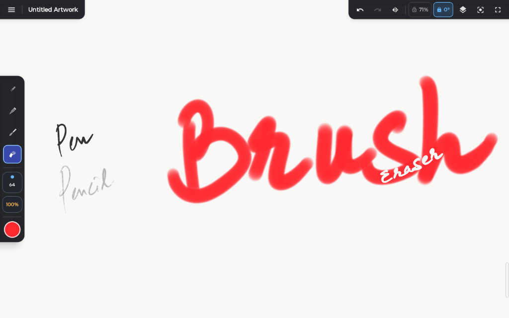

# Milton for Android

  

  <strong>Distraction-Free Infinite Canvas Sketching for Android Tablets</strong>

  
  
  

---

## Overview

**Milton** is a fast, distraction-free infinite canvas sketching app designed specifically for Android tablets and active styluses (S-Pen, Xiaomi Pen, Lenovo Precision Pen, and universal active styluses).

Never worry about canvas boundaries or fixed resolutions again. Just pick up your stylus and sketch freely across an endless workspace that lets you zoom, pan, and rotate smoothly at any scale without losing clarity.

  

---

## Features

- **Infinite Sketching Canvas**:
  - Boundless workspace without borders, page edges, or fixed pixel boundaries.
  - Fluid multi-touch pan, smooth zoom, and continuous canvas rotation.
  - Instant horizontal canvas flip to check proportions and symmetry.

- **Natural Stylus Response**:
  - Ultra-low latency pen strokes via front-buffered rendering.
  - Strict hardware palm rejection: fingers navigate while your stylus exclusively sketches.
  - Pressure sensitivity with customizable Bézier response curves for both stroke size and opacity.

- **Focused Toolset**:
  - **Pencil, Pen, Paintbrush, & Eraser** tuned for sketching, linework, and shading.
  - **Lasso & Free Transform**: Draw around any part of your sketch to move, scale, or rotate it across single or multiple layers.
  - **Eyedropper** with real-time screen reticle sampling.

- **Layers & Focus**:
  - Clean multi-layer workflow with opacity adjustments and drag-and-drop reordering.
  - Zen Mode for a completely uncluttered, full-screen sketching experience.

- **Fast Export & Saving**:
  - High-resolution offscreen PNG export.
  - Lightweight `.milton` project files with debounced autosave.
  - Full hardware keyboard shortcut support for rapid desktop-grade workflows.

---

## Requirements

- **OS**: Android 8.0 (API 26) or newer (optimized for tablets)
- **Input**: Active pressure-sensitive stylus and multi-touch display

---

## License

Copyright (c) 2026. All rights reserved.
